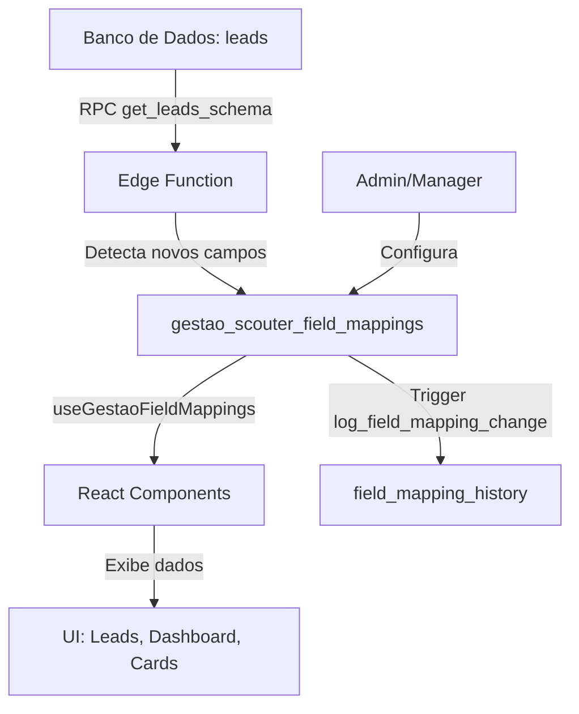

# Sistema de Mapeamento de Campos do Gestão Scouter

## 📋 Visão Geral

O Sistema de Mapeamento de Campos permite que administradores e gerentes configurem dinamicamente quais campos da tabela `leads` são exibidos no módulo Gestão Scouter, incluindo:

- **Lista de Leads**: Colunas exibidas na tabela
- **Dashboard Avançado**: Dimensões e métricas disponíveis para análise
- **Cards Tinder**: Campos exibidos nos cards de análise

## 🎯 Funcionalidades

### ✅ Funcionalidades Implementadas

1. **Mapeamento Dinâmico de Campos**
   - Arraste e solte para reordenar campos
   - Adicionar/remover campos disponíveis
   - Configurar propriedades de exibição

2. **Configuração por Campo**
   - Nome de exibição customizável
   - Tipo de dado (texto, número, data, moeda, booleano)
   - Categoria para agrupamento
   - Visibilidade padrão
   - Ordenável (sim/não)
   - Formatação automática

3. **Sincronização Automática**
   - Detecção de novos campos no banco de dados
   - Adição automática com configurações padrão inteligentes
   - Categorização automática baseada no nome do campo

4. **Auditoria Completa**
   - Histórico de alterações em mapeamentos
   - Registro de quem fez cada alteração
   - Timestamps de criação e modificação

## 🔧 Como Usar

### Acessar a Configuração

1. Faça login como **Admin** ou **Manager**
2. Acesse o módulo **Gestão Scouter**
3. No menu lateral, clique em **⚙️ Configurar Campos**

### Adicionar um Campo

1. Na coluna da esquerda, procure o campo desejado
2. Clique no campo para adicioná-lo ao mapeamento
3. O campo será adicionado com configurações padrão inteligentes

### Reordenar Campos

1. Na coluna da direita, arraste um campo pela alça (ícone de grip)
2. Solte na posição desejada
3. A ordem será salva automaticamente

### Editar um Campo

1. Na coluna da direita, clique no botão **✏️ Editar** do campo
2. Configure as propriedades:
   - **Nome de Exibição**: Como o campo aparece na interface
   - **Tipo**: Formato do dado (texto, número, data, etc.)
   - **Categoria**: Grupo do campo (básico, contato, status, etc.)
   - **Visível por Padrão**: Se deve aparecer inicialmente nas listas
   - **Ordenável**: Se permite ordenação na tabela
   - **Ativo**: Se o campo está disponível para uso
3. Clique em **💾 Salvar**

### Remover um Campo

1. Na coluna da direita, clique no botão **🗑️ Deletar** do campo
2. Confirme a remoção

### Sincronizar Novos Campos

1. Clique no botão **🔄 Sincronizar Campos do Banco**
2. O sistema detectará automaticamente novos campos na tabela `leads`
3. Novos campos serão adicionados com configurações padrão

## 📊 Categorias de Campos

Os campos são organizados em categorias para facilitar a gestão:

| Categoria | Descrição | Exemplos |
|-----------|-----------|----------|
| **Básico** | Informações fundamentais | Nome, Idade, Projeto |
| **Contato** | Dados de contato | Celular, Email, Telefone |
| **Status** | Estados e etapas | Status Tabulação, Etapa, Ficha Confirmada |
| **Localização** | Dados geográficos | Endereço, Latitude, Longitude |
| **Datas** | Informações temporais | Data Criação, Data Agendamento |
| **Sincronização** | Dados de sync | Sync Status, Sync Source |
| **Outro** | Demais campos | Campos não categorizados |

## 🔄 Tipos de Dados e Formatação

### Tipos Suportados

| Tipo | Descrição | Formatação Automática |
|------|-----------|----------------------|
| `text` | Texto simples | Nenhuma |
| `number` | Número inteiro ou decimal | Formatação numérica |
| `boolean` | Verdadeiro/Falso | "Sim" / "Não" |
| `date` | Data ou timestamp | DD/MM/YYYY |
| `currency` | Valor monetário | R$ 0.000,00 |

### Funções de Formatação

O sistema aplica automaticamente formatadores baseados no tipo:

```typescript
// Exemplo de formatadores
formatDateBR: (value) => new Date(value).toLocaleDateString('pt-BR')
formatCurrency: (value) => new Intl.NumberFormat('pt-BR', { 
  style: 'currency', 
  currency: 'BRL' 
}).format(value)
formatBoolean: (value) => value ? 'Sim' : 'Não'
```

## 🏗️ Arquitetura Técnica

### Componentes

```
src/
├── hooks/
│   ├── useGestaoFieldMappings.ts      # Hook para buscar mapeamentos
│   └── useLeadColumnConfig.ts         # Gerencia colunas visíveis
├── components/gestao/
│   ├── GestaoScouterFieldMappingDragDrop.tsx  # Interface drag-and-drop
│   └── Sidebar.tsx                    # Sidebar com link de config
└── pages/gestao/
    ├── ConfigurarCampos.tsx           # Página de configuração
    └── Leads.tsx                      # Lista de leads (atualizada)
```

### Backend

```
supabase/
├── migrations/
│   └── XXXXXX_create_gestao_scouter_field_mappings.sql
└── functions/
    └── sync-gestao-scouter-fields/
        └── index.ts                   # Edge function de sincronização
```

### Banco de Dados

**Tabela: `gestao_scouter_field_mappings`**

```sql
CREATE TABLE gestao_scouter_field_mappings (
  id UUID PRIMARY KEY,
  database_field TEXT NOT NULL UNIQUE,     -- Nome do campo no banco
  display_name TEXT NOT NULL,              -- Nome exibido na UI
  field_type TEXT NOT NULL,                -- Tipo do campo
  category TEXT NOT NULL,                  -- Categoria
  default_visible BOOLEAN DEFAULT false,   -- Visível por padrão
  sortable BOOLEAN DEFAULT true,           -- Permite ordenação
  priority INTEGER DEFAULT 0,              -- Ordem de exibição
  formatter_function TEXT,                 -- Nome da função de formatação
  active BOOLEAN DEFAULT true,             -- Campo ativo
  created_at TIMESTAMPTZ DEFAULT NOW(),
  updated_at TIMESTAMPTZ DEFAULT NOW(),
  created_by UUID REFERENCES auth.users(id),
  updated_by UUID REFERENCES auth.users(id)
);
```

## 🔐 Permissões

### RLS Policies

- **SELECT**: Todos os usuários autenticados podem visualizar campos ativos
- **INSERT/UPDATE/DELETE**: Apenas Admins e Managers

### Acesso à Interface

- Página de configuração: Requer role `admin` ou `manager`
- Link no sidebar: Aparece apenas para admins/managers

## 🚀 Fluxo de Dados



## 📝 Exemplos de Uso

### Exemplo 1: Adicionar Campo "Data de Nascimento"

```sql
-- Adicionar coluna na tabela leads
ALTER TABLE leads ADD COLUMN data_nascimento DATE;

-- Sincronizar (via UI ou edge function)
-- O sistema detectará automaticamente e adicionará com:
-- - display_name: "Data Nascimento"
-- - field_type: "date"
-- - category: "dates"
-- - formatter_function: "formatDateBR"
```

### Exemplo 2: Customizar Campo Existente

1. Acesse **Configurar Campos**
2. Encontre o campo "celular"
3. Edite:
   - Display Name: "📱 Celular"
   - Categoria: "contact"
   - Visível por Padrão: ✅
4. Salve

O campo aparecerá com o emoji em todas as listas!

### Exemplo 3: Criar Campo Calculado (Futuro)

```typescript
// Em useGestaoFieldMappings.ts
const calculatedFields = {
  idade_aproximada: {
    key: 'idade_aproximada',
    label: 'Idade Aproximada',
    type: 'number',
    formatter: (_, lead) => {
      if (!lead.data_nascimento) return '-';
      const anos = Math.floor(
        (new Date().getTime() - new Date(lead.data_nascimento).getTime()) 
        / (365.25 * 24 * 60 * 60 * 1000)
      );
      return `${anos} anos`;
    }
  }
};
```

## 🐛 Troubleshooting

### Problema: Novo campo não aparece

**Solução**:
1. Verifique se o campo existe na tabela `leads`
2. Clique em "🔄 Sincronizar Campos do Banco"
3. Se persistir, verifique os logs da edge function

### Problema: Ordem não salva ao arrastar

**Solução**:
1. Verifique se você é Admin/Manager
2. Verifique o console do navegador por erros
3. Certifique-se de que as RLS policies estão ativas

### Problema: Campo não formata corretamente

**Solução**:
1. Edite o campo
2. Verifique o "Tipo" configurado
3. Para formatação custom, edite `useGestaoFieldMappings.ts`

## 🔮 Próximos Passos (Roadmap)

- [ ] **Export/Import**: Exportar e importar configurações como JSON
- [ ] **Campos Calculados**: Suporte para campos derivados/calculados
- [ ] **Validações**: Regras de validação por campo
- [ ] **Campos Relacionados**: Lookup em outras tabelas
- [ ] **Permissões Granulares**: Controle de visibilidade por role
- [ ] **Templates**: Salvar conjuntos de configurações como templates
- [ ] **Versionamento**: Histórico de versões das configurações

## 📚 Referências

- [Documentação do Supabase RLS](https://supabase.com/docs/guides/auth/row-level-security)
- [React Query](https://tanstack.com/query/latest)
- [Drag and Drop API](https://developer.mozilla.org/en-US/docs/Web/API/HTML_Drag_and_Drop_API)

## 🤝 Contribuindo

Para sugerir melhorias ou reportar bugs:

1. Documente o comportamento esperado vs atual
2. Inclua prints ou vídeos quando possível
3. Mencione sua role (admin/manager/agent)
4. Descreva os passos para reproduzir

---

**Desenvolvido com ❤️ para o Gestão Scouter**
