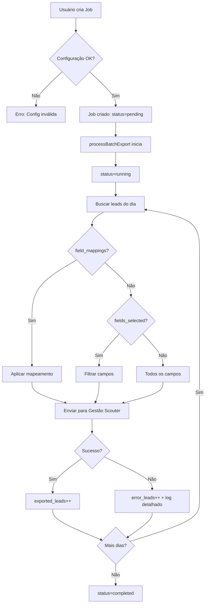

# ✅ Correção Completa da Integração Gestão Scouter

**Data:** 2025-10-21  
**Status:** ✅ IMPLEMENTADO

## 🎯 Problemas Corrigidos

### 1. **Schema Database (CRÍTICO)**
- ✅ Padronizado `fields_selected` para `TEXT[]` (removido conflito com JSONB)
- ✅ Garantido que `field_mappings` existe como `JSONB`
- ✅ Criada função RPC `get_leads_table_columns()` para acesso seguro ao schema
- ✅ Forçado reload do cache PostgREST
- ✅ Índices adicionados para performance

### 2. **Edge Function: get-gestao-scouter-fields**
- ✅ **ANTES:** Acesso direto a `information_schema.columns` via `supabase.from()` ❌
- ✅ **DEPOIS:** Usa RPC `get_leads_table_columns()` ✅
- ✅ Logs detalhados adicionados

### 3. **Edge Function: validate-gestao-scouter-schema**
- ✅ **ANTES:** HTTP calls para `get-gestao-scouter-fields` ❌
- ✅ **DEPOIS:** RPC direto ao schema via `get_leads_table_columns()` ✅
- ✅ Mais eficiente, sem overhead de HTTP

### 4. **Edge Function: export-to-gestao-scouter-batch**
- ✅ Já estava correto, apenas aguardando correção do schema

---

## 🚨 AÇÃO NECESSÁRIA NO GESTÃO SCOUTER

Para que a validação de schema funcione, o projeto **Gestão Scouter** precisa ter a mesma função RPC.

**Execute este SQL no projeto Gestão Scouter:**

```sql
-- Criar função RPC para buscar schema da tabela leads
CREATE OR REPLACE FUNCTION public.get_leads_table_columns()
RETURNS TABLE (
  column_name TEXT,
  data_type TEXT,
  is_nullable TEXT
) 
LANGUAGE plpgsql
SECURITY DEFINER
SET search_path = public
AS $$
BEGIN
  RETURN QUERY
  SELECT 
    c.column_name::TEXT,
    c.data_type::TEXT,
    c.is_nullable::TEXT
  FROM information_schema.columns c
  WHERE c.table_schema = 'public'
    AND c.table_name = 'leads'
  ORDER BY c.ordinal_position;
END;
$$;

COMMENT ON FUNCTION public.get_leads_table_columns() IS 
'Retorna schema da tabela leads para validação de sincronização com TabuladorMax';

-- Forçar reload do schema
NOTIFY pgrst, 'reload schema';
```

---

## 🧪 Como Testar

### **1. Validar Schema**
```bash
# Na UI, clique em "Validar Schema" na aba Gestão Scouter
# Deve retornar comparação de campos sem erros
```

### **2. Criar Exportação em Lote**
```bash
# 1. Configure datas de início/fim
# 2. (Opcional) Configure mapeamento de campos
# 3. Clique em "Iniciar Exportação"
# 4. Monitore na tabela de Jobs
```

### **3. Verificar Logs de Erro**
```sql
-- Se houver erros, consulte a tabela:
SELECT * FROM gestao_scouter_export_errors
ORDER BY created_at DESC
LIMIT 10;
```

---

## 📊 Estrutura Atualizada

### **Tabela: gestao_scouter_export_jobs**
```sql
- id: UUID
- start_date: DATE
- end_date: DATE
- status: TEXT (pending, running, paused, completed, failed)
- fields_selected: TEXT[] -- LEGACY (array de campos)
- field_mappings: JSONB  -- NEW (objeto com mapeamentos)
- total_leads: INT
- exported_leads: INT
- error_leads: INT
- ...
```

### **Função RPC: get_leads_table_columns()**
```sql
-- Retorna schema da tabela leads
RETURNS TABLE (
  column_name TEXT,
  data_type TEXT,
  is_nullable TEXT
)
```

---

## 🔄 Fluxo de Exportação



---

## ✅ Checklist de Validação

- [ ] Migração do TabuladorMax aplicada com sucesso
- [ ] SQL executado no Gestão Scouter (função RPC criada)
- [ ] "Validar Schema" retorna comparação sem erros
- [ ] Exportação em lote funciona sem "non-2xx status code"
- [ ] Erros são logados em `gestao_scouter_export_errors`
- [ ] Mapeamento de campos funcional (se usado)

---

## 📞 Próximos Passos

1. ✅ **Testar validação de schema** - deve funcionar agora
2. ✅ **Testar exportação em lote** - sem erros de schema
3. ⚠️ **Monitorar logs** - verificar se há erros de sincronização
4. 🔧 **Ajustar mapeamentos** - se necessário

---

## 🛠️ Troubleshooting

### "Função get_leads_table_columns não encontrada"
**Solução:** Execute o SQL no projeto Gestão Scouter (veja seção "AÇÃO NECESSÁRIA")

### "Edge Function returned a non-2xx status code"
**Solução:** Verifique logs da Edge Function no Lovable Cloud

### "Could not find the 'field_mappings' column"
**Solução:** Migração já foi aplicada, force reload: `NOTIFY pgrst, 'reload schema';`

---

**Status Final:** 🎉 Integração corrigida e pronta para uso!
