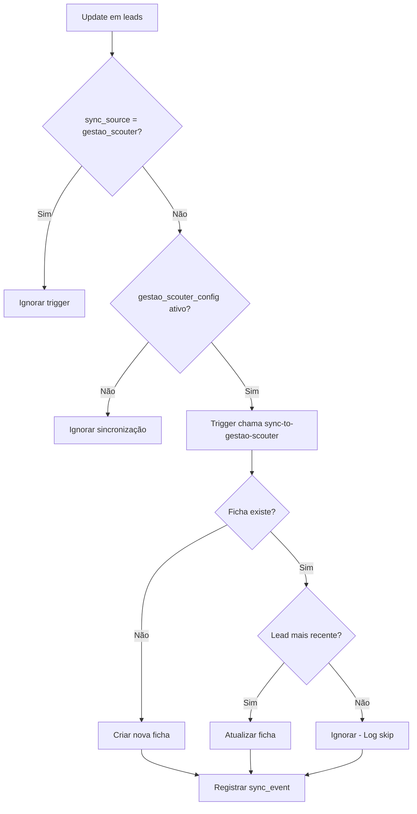
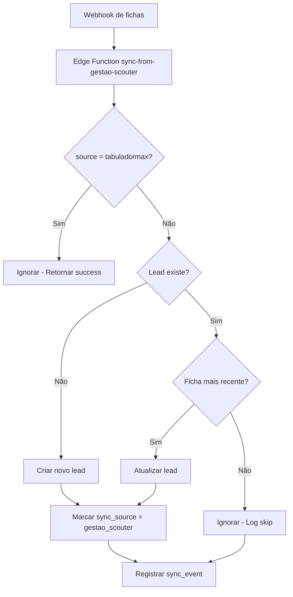

# Implementação da Correção de Conflitos e Sincronização

## Resumo das Alterações

Este documento descreve as mudanças implementadas para corrigir conflitos e erros de sincronização entre TabuladorMax e Gestão Scouter.

## Arquivos Modificados

### 1. Migration: `20251017030000_fix_sync_conflicts.sql`

#### Alterações:
- **Adição de colunas de sincronização na tabela `leads`** (se não existirem):
  - `sync_source TEXT` - Origem da última sincronização (bitrix, supabase, gestao_scouter, csv)
  - `sync_status TEXT` - Status da última sincronização (synced, syncing, error, pending)
  - `last_sync_at TIMESTAMPTZ` - Data/hora da última sincronização bem-sucedida

- **Criação de índices**:
  - `idx_leads_sync_source`
  - `idx_leads_sync_status`
  - `idx_leads_last_sync_at`

- **Atualização da função `trigger_sync_to_bitrix()`**:
  - Agora ignora atualizações com `sync_source IN ('bitrix', 'supabase', 'gestao_scouter', 'gestao-scouter')`
  - Previne loops de sincronização entre os três sistemas

- **População inicial da tabela `gestao_scouter_config`**:
  - Insere um registro padrão se não existir nenhum ativo
  - `active = true` e `sync_enabled = true` por padrão
  - Requer configuração manual das credenciais (project_url e anon_key)

### 2. Edge Function: `sync-from-gestao-scouter/index.ts`

#### Alterações:
- **Resolução de conflitos baseada em `updated_at`**:
  - Verifica se existe um lead com o mesmo ID
  - Compara as datas `updated_at` da ficha e do lead existente
  - Se a ficha for mais antiga, ignora a atualização e registra no log
  - Evita sobrescrever dados mais recentes com versões antigas

- **Logging detalhado em `sync_events`**:
  - Campo `error_message` agora armazena JSON com metadados:
    - `action`: 'sync_from_gestao_scouter'
    - `lead_name`: Nome do lead
    - `sync_source`: 'gestao_scouter'
    - `timestamp`: Data/hora da operação
  - Registra também atualizações ignoradas (skipped)

### 3. Edge Function: `sync-to-gestao-scouter/index.ts`

#### Alterações:
- **Resolução de conflitos baseada em `updated_at`**:
  - Verifica se existe uma ficha com o mesmo ID
  - Compara as datas `updated_at` do lead e da ficha existente
  - Se o lead for mais antigo, ignora a atualização e registra no log
  - Evita sobrescrever dados mais recentes com versões antigas

- **Logging detalhado em `sync_events`**:
  - Campo `error_message` agora armazena JSON com metadados:
    - `action`: 'sync_to_gestao_scouter'
    - `lead_name`: Nome do lead
    - `sync_source`: 'supabase'
    - `timestamp`: Data/hora da operação
  - Registra também atualizações ignoradas (skipped)

## Fluxo de Sincronização

### Cenário 1: Atualização no TabuladorMax → Gestão Scouter



### Cenário 2: Atualização no Gestão Scouter → TabuladorMax



## Mecanismos de Prevenção de Loops

### 1. Campo `sync_source`
- Marca a origem de cada atualização
- Triggers verificam este campo antes de disparar
- Edge Functions também verificam via parâmetro `source`

### 2. Trigger WHEN Clause
```sql
WHEN (
  OLD.sync_source IS DISTINCT FROM 'gestao_scouter' 
  AND NEW.sync_source IS DISTINCT FROM 'gestao_scouter'
  AND OLD.sync_source IS DISTINCT FROM 'gestao-scouter'
  AND NEW.sync_source IS DISTINCT FROM 'gestao-scouter'
)
```

### 3. Verificação no Início das Edge Functions
```typescript
if (source === 'gestao_scouter' || source === 'gestao-scouter') {
  return success (ignored)
}
```

### 4. Reset de sync_source
```plpgsql
IF NEW.sync_source IN ('gestao_scouter', ...) THEN
  NEW.sync_source := NULL;
  RETURN NEW;
END IF;
```

## Resolução de Conflitos

### Estratégia: Last-Write-Wins baseado em `updated_at`

**Regra:** A versão mais recente (maior `updated_at`) sempre prevalece.

**Implementação:**
1. Ao receber uma atualização, verifica se o registro de destino existe
2. Compara `updated_at` da origem com `updated_at` do destino
3. Se origem for mais antiga, ignora a atualização
4. Se origem for mais recente ou igual, aplica a atualização

**Benefícios:**
- Previne perda de dados recentes
- Determinístico (sempre o mesmo resultado dado os mesmos dados)
- Simples de implementar e debugar

## Configuração Necessária

### 1. Credenciais do Gestão Scouter

Após aplicar as migrações, configurar:

```sql
UPDATE gestao_scouter_config
SET 
  project_url = 'https://[SEU_PROJETO_GESTAO_SCOUTER].supabase.co',
  anon_key = '[SUA_ANON_KEY]'
WHERE active = true;
```

### 2. Webhook no Gestão Scouter

Configurar trigger/webhook na tabela `fichas` para chamar:
```
https://[SEU_PROJETO_TABULADORMAX].supabase.co/functions/v1/sync-from-gestao-scouter
```

## Monitoramento

### Verificar sincronizações recentes:
```sql
SELECT 
  event_type,
  direction,
  lead_id,
  status,
  error_message::jsonb AS details,
  sync_duration_ms,
  created_at
FROM sync_events
WHERE direction IN ('supabase_to_gestao_scouter', 'gestao_scouter_to_supabase')
ORDER BY created_at DESC
LIMIT 100;
```

### Verificar atualizações ignoradas:
```sql
SELECT *
FROM sync_events
WHERE error_message LIKE '%Skipped%'
ORDER BY created_at DESC;
```

### Verificar erros:
```sql
SELECT *
FROM sync_events
WHERE status = 'error'
  AND direction IN ('supabase_to_gestao_scouter', 'gestao_scouter_to_supabase')
ORDER BY created_at DESC;
```

## Troubleshooting

### Problema: Sincronização não está funcionando

**Checklist:**
1. Verificar se `gestao_scouter_config` está ativo e com credenciais corretas
2. Verificar logs das Edge Functions
3. Verificar se triggers estão habilitados
4. Verificar se `sync_source` está sendo setado corretamente

### Problema: Loops de sincronização

**Checklist:**
1. Verificar se `sync_source` está sendo resetado para NULL após trigger
2. Verificar se Edge Functions estão checando o parâmetro `source`
3. Verificar logs de `sync_events` para identificar padrões

### Problema: Dados sendo sobrescritos incorretamente

**Checklist:**
1. Verificar se `updated_at` está sendo atualizado corretamente em ambas as tabelas
2. Verificar logs para ver se resolução de conflitos está funcionando
3. Comparar timestamps das atualizações

## Testes Recomendados

Consultar o documento `docs/TESTE_SINCRONIZACAO_GESTAO_SCOUTER.md` para um guia completo de testes.

## Próximos Passos

1. Configurar credenciais do Gestão Scouter na tabela `gestao_scouter_config`
2. Configurar webhook/trigger no Gestão Scouter
3. Executar testes de sincronização conforme documentação
4. Monitorar logs por 24-48h para garantir estabilidade
5. Ajustar configurações conforme necessário

## Suporte

Para problemas ou dúvidas:
1. Verificar logs em `sync_events`
2. Verificar logs das Edge Functions no dashboard do Supabase
3. Consultar documentação de teste
