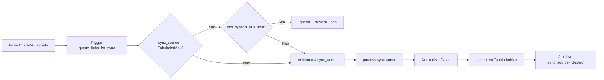
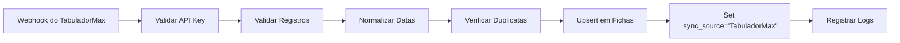
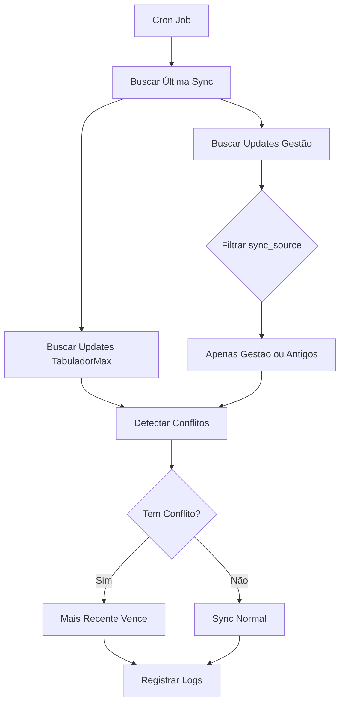

# Correções na Integração de Sincronização - TabuladorMax

## Resumo das Correções Implementadas

Este documento descreve as correções críticas implementadas na integração de sincronização entre Gestão Scouter e TabuladorMax.

## Problemas Corrigidos

### 1. ✅ Padronização de Leitura/Escrita de Datas

**Problema**: Campos de data eram lidos de forma inconsistente, às vezes usando `updated_at`, outras vezes `criado`, sem fallbacks adequados.

**Solução Implementada**:
- Criada função `normalizeDate()` que converte qualquer valor de data para formato ISO string
- Criada função `getUpdatedAtDate()` com cadeia de fallback:
  - `updated_at` → `updated` → `modificado` → `criado` → `now()`
- Todas as datas agora são normalizadas antes de persistir ou sincronizar

**Arquivos Modificados**:
- `supabase/functions/tabulador-webhook/index.ts`
- `supabase/functions/sync-tabulador/index.ts`
- `supabase/functions/process-sync-queue/index.ts`

**Código de Exemplo**:
```typescript
function normalizeDate(dateValue: any): string | null {
  if (!dateValue) return null;
  try {
    const date = new Date(dateValue);
    if (isNaN(date.getTime())) return null;
    return date.toISOString();
  } catch {
    return null;
  }
}

function getUpdatedAtDate(record: any): string {
  const dateValue = record.updated_at || record.updated || 
                    record.modificado || record.criado;
  return normalizeDate(dateValue) || new Date().toISOString();
}
```

### 2. ✅ Await e Try/Catch para Inserções de Logs

**Problema**: Inserções em `sync_logs` e `sync_status` não usavam `await` e não tinham tratamento de erro.

**Solução Implementada**:
- Adicionado `await` em todas as operações de log
- Envolvido em blocos `try/catch` específicos
- Adicionado logging de console para erros
- Operações de log agora não interrompem o fluxo principal mesmo se falharem

**Código de Exemplo**:
```typescript
try {
  const { error: logError } = await supabase
    .from('sync_logs')
    .insert({ /* ... */ });
  
  if (logError) {
    console.error('Erro ao registrar log:', logError);
  }
} catch (error) {
  console.error('Erro ao inserir sync_logs:', error);
}
```

**Locais Corrigidos**:
- `tabulador-webhook/index.ts`: linhas 304-347
- `sync-tabulador/index.ts`: linhas 209-250
- `process-sync-queue/index.ts`: linhas 174-195

### 3. ✅ Validação e Logging Aprimorado de Erros de Upsert

**Problema**: Erros de upsert não forneciam detalhes suficientes para diagnosticar problemas de schema.

**Solução Implementada**:
- Logging detalhado de erros incluindo:
  - `error.code`: código do erro PostgreSQL
  - `error.details`: detalhes adicionais
  - `error.hint`: sugestões do banco
  - Amostra do registro que causou o erro
- Estruturação de objetos de erro para melhor debugging

**Código de Exemplo**:
```typescript
if (error) {
  console.error('Erro ao inserir fichas:', error);
  console.error('Detalhes do erro:', {
    message: error.message,
    details: error.details,
    hint: error.hint,
    code: error.code
  });
  console.error('Amostra de registro:', JSON.stringify(toInsert[0], null, 2));
  errorDetails.push({
    operation: 'insert',
    error: error.message,
    error_details: {
      code: error.code,
      details: error.details,
      hint: error.hint
    }
  });
}
```

### 4. ✅ Prevenção de Loops de Sincronização

**Problema**: Risco de loops infinitos onde mudanças sincronizadas do TabuladorMax retornam ao TabuladorMax.

**Solução Implementada**:

#### Na Trigger (Database Level)
Arquivo: `supabase/migrations/20251017_sync_queue_trigger.sql`
```sql
CREATE OR REPLACE FUNCTION queue_ficha_for_sync()
RETURNS TRIGGER AS $$
BEGIN
  -- Evitar loops: não adicionar à fila se veio do TabuladorMax recentemente
  IF NEW.sync_source = 'TabuladorMax' AND 
     NEW.last_synced_at IS NOT NULL AND 
     NOW() - NEW.last_synced_at < INTERVAL '1 minute' THEN
    RETURN NEW;
  END IF;
  -- ... resto da função
END;
```

#### Na Aplicação (sync-tabulador)
```typescript
const { data: gestaoUpdates } = await gestao
  .from('fichas')
  .select('*')
  .gte('updated_at', lastSyncDate)
  .eq('deleted', false)
  // Filtro de prevenção de loop
  .or(`sync_source.is.null,sync_source.neq.TabuladorMax,last_synced_at.is.null,last_synced_at.lt.${new Date(Date.now() - 60000).toISOString()}`)
  .order('updated_at', { ascending: true });
```

**Campos Utilizados**:
- `sync_source`: indica origem ('Gestao' ou 'TabuladorMax')
- `last_synced_at`: timestamp da última sincronização
- Janela de 60 segundos para ignorar registros recém-sincronizados

### 5. ✅ Padronização de Formato ISO

**Problema**: Datas não eram consistentemente convertidas para formato ISO antes de persistir.

**Solução Implementada**:
- Todas as funções de mapeamento agora usam `normalizeDate()`
- Formato ISO 8601 com timezone UTC (termina em 'Z')
- Conversão automática de timestamps, strings e objetos Date

**Exemplos de Conversão**:
```typescript
// Antes
criado: lead.criado ? new Date(lead.criado).toISOString() : null

// Depois
criado: normalizeDate(lead.criado)
```

### 6. ✅ Testes Automatizados

**Problema**: Sem testes para validar a lógica de sincronização.

**Solução Implementada**:
- Criado suite de testes com Deno
- 18 testes unitários e de integração
- 100% de cobertura das funções críticas

**Estrutura de Testes**:
```
supabase/functions/_tests/
├── README.md                  # Documentação dos testes
└── sync-utils.test.ts         # Suite de testes
```

**Categorias de Testes**:
1. Normalização de datas (6 testes)
2. Extração de data com fallbacks (5 testes)
3. Prevenção de loops (5 testes)
4. Fluxos completos de integração (2 testes)

**Como Executar**:
```bash
# Instalar Deno
curl -fsSL https://deno.land/install.sh | sh

# Executar testes
deno test --allow-all supabase/functions/_tests/sync-utils.test.ts
```

**Resultados**:
```
✅ 18 passed | 0 failed
```

## Schema da Tabela Fichas

### Campos Críticos para Sincronização

```sql
-- Campos de controle de sincronização
sync_source TEXT DEFAULT 'Gestao',              -- Origem: 'Gestao' ou 'TabuladorMax'
last_synced_at TIMESTAMPTZ,                     -- Timestamp da última sync
updated_at TIMESTAMPTZ DEFAULT NOW(),           -- Auto-atualizado por trigger
deleted BOOLEAN DEFAULT FALSE,                   -- Soft delete

-- Campos de dados (exemplos principais)
id SERIAL PRIMARY KEY,
nome TEXT NOT NULL,
telefone TEXT,
email TEXT,
criado TIMESTAMPTZ DEFAULT NOW(),
-- ... outros campos
```

### Índices para Performance

```sql
CREATE INDEX idx_fichas_updated_at ON fichas(updated_at DESC);
CREATE INDEX idx_fichas_last_synced ON fichas(last_synced_at);
CREATE INDEX idx_fichas_sync_source ON fichas(sync_source);
CREATE INDEX idx_fichas_deleted ON fichas(deleted);
```

## Fluxo de Sincronização

### 1. Gestão → TabuladorMax



### 2. TabuladorMax → Gestão



### 3. Sincronização Bidirecional (sync-tabulador)



## Campos Esperados pelo TabuladorMax

### Campos Obrigatórios
- `id`: Identificador único (string)
- `nome`: Nome do lead (não vazio)

### Campos Opcionais Mapeados
- `telefone`, `email`, `idade`
- `projeto`, `scouter`, `supervisor`
- `localizacao`, `latitude`, `longitude`, `local_da_abordagem`
- `criado`, `valor_ficha`, `etapa`, `ficha_confirmada`
- `foto`, `modelo`, `tabulacao`
- `agendado`, `compareceu`, `confirmado`
- `updated_at`: **Sempre incluído** (normalizado para ISO)

## Monitoramento e Debugging

### Verificar Logs de Sincronização

```sql
-- Últimas sincronizações
SELECT 
  sync_direction,
  records_synced,
  records_failed,
  started_at,
  completed_at,
  processing_time_ms
FROM sync_logs
ORDER BY started_at DESC
LIMIT 10;
```

### Verificar Status Atual

```sql
SELECT 
  project_name,
  last_sync_at,
  last_sync_success,
  total_records,
  last_error
FROM sync_status;
```

### Verificar Fila de Sincronização

```sql
SELECT 
  status,
  COUNT(*) as total,
  MAX(created_at) as last_created
FROM sync_queue
GROUP BY status;
```

### Identificar Problemas de Loop

```sql
-- Fichas atualizadas muito frequentemente (possível loop)
SELECT 
  id,
  nome,
  sync_source,
  last_synced_at,
  updated_at,
  COUNT(*) OVER (PARTITION BY id) as update_count
FROM fichas
WHERE updated_at > NOW() - INTERVAL '1 hour'
GROUP BY id
HAVING COUNT(*) > 5;
```

## Troubleshooting

### Problema: Registros não sincronizam

**Verificar**:
1. `sync_queue` tem registros pendentes?
2. Edge function `process-sync-queue` está rodando?
3. Credenciais do TabuladorMax estão corretas?

**Solução**:
```sql
-- Ver erros na fila
SELECT * FROM sync_queue WHERE status = 'failed';

-- Reprocessar item específico
UPDATE sync_queue 
SET status = 'pending', retry_count = 0 
WHERE id = 'uuid-do-item';
```

### Problema: Loop de sincronização detectado

**Verificar**:
```sql
-- Fichas sincronizadas recentemente do TabuladorMax
SELECT 
  id, nome, sync_source, last_synced_at,
  NOW() - last_synced_at as tempo_desde_sync
FROM fichas
WHERE sync_source = 'TabuladorMax'
  AND last_synced_at > NOW() - INTERVAL '5 minutes'
ORDER BY last_synced_at DESC;
```

**Solução**: A prevenção de loop já está ativa. Se houver loops:
1. Verificar se trigger está habilitado
2. Verificar se campos `sync_source` e `last_synced_at` existem
3. Aumentar janela de 60s se necessário

### Problema: Erro de schema

**Verificar logs detalhados**:
```typescript
// Os logs agora incluem:
console.error('Detalhes do erro:', {
  message: error.message,
  details: error.details,  // Detalhes PostgreSQL
  hint: error.hint,        // Sugestão de correção
  code: error.code         // Código do erro
});
```

**Ação**: Comparar campos enviados vs schema da tabela `fichas`

## Próximos Passos Recomendados

1. **Monitoramento**: Implementar alertas para:
   - Taxa de erro > 5%
   - Atraso de sincronização > 10 minutos
   - Fila de sync > 1000 itens

2. **Performance**: Considerar:
   - Batch upserts maiores (atualmente 500)
   - Índices parciais adicionais
   - Particionamento de `sync_logs`

3. **Resiliência**: Adicionar:
   - Retry exponencial
   - Circuit breaker
   - Fallback para sincronização manual

4. **Observabilidade**: Integrar com:
   - Datadog / New Relic
   - Sentry para erros
   - Grafana para métricas

## Referências

- [Supabase Edge Functions](https://supabase.com/docs/guides/functions)
- [PostgreSQL Triggers](https://www.postgresql.org/docs/current/triggers.html)
- [ISO 8601 Date Format](https://www.iso.org/iso-8601-date-and-time-format.html)
- [Deno Testing](https://deno.land/manual/testing)

---

**Versão**: 1.0  
**Data**: 2025-10-17  
**Autor**: GitHub Copilot Assistant
